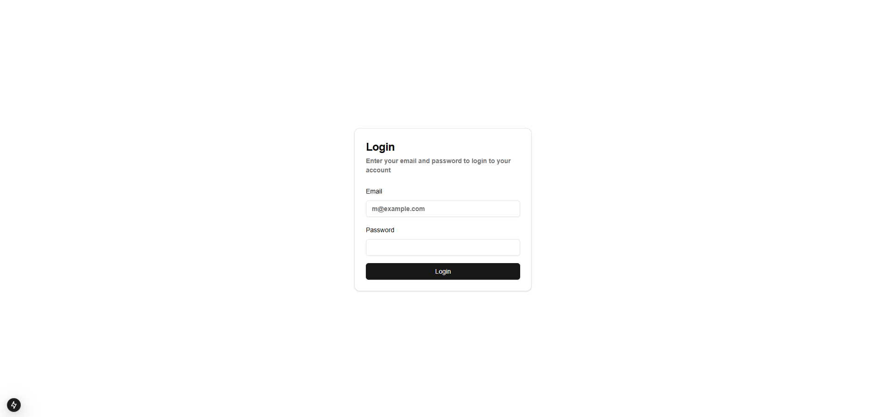
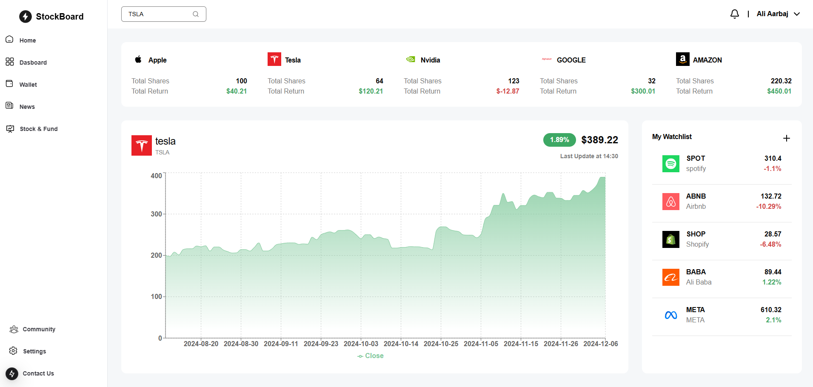

# Stock Dashboard

A modern, responsive web application for tracking stock prices and portfolio performance.

## 🚀 Features

- Real-time stock price tracking
- Interactive dashboard
- Responsive UI design
- Authentication system

## 🖥️ Screenshots

| Login Screen | Dashboard Home |
|--------------|----------------|
|  |  |

## 🛠 Technologies Used

- Frontend: React, Next.js, Tailwind CSS
- Backend: Express.js, TypeScript
- Database: MongoDB
- Authentication: JWT
- Charting: [Your Charting Library]

## 📦 Installation

1. Clone the repository
```bash
git clone https://github.com/yourusername/stock-dashboard.git
```

2. Install dependencies
```bash
npm install
```

3. Set up environment variables
- Create a `.env` file
- Add necessary configurations

4. Run the application
```bash
npm run dev
```

## 🔒 Authentication

Secure login with JWT-based authentication

## 🌐 Deployment

[Add deployment instructions]

## 📝 Future Roadmap

- [ ] Real-time stock updates
- [ ] Portfolio tracking
- [ ] Advanced charting
- [ ] Social features

## 👥 Contributing

Contributions are welcome! Please read the contributing guidelines.

## 📄 License

[Specify your license]
